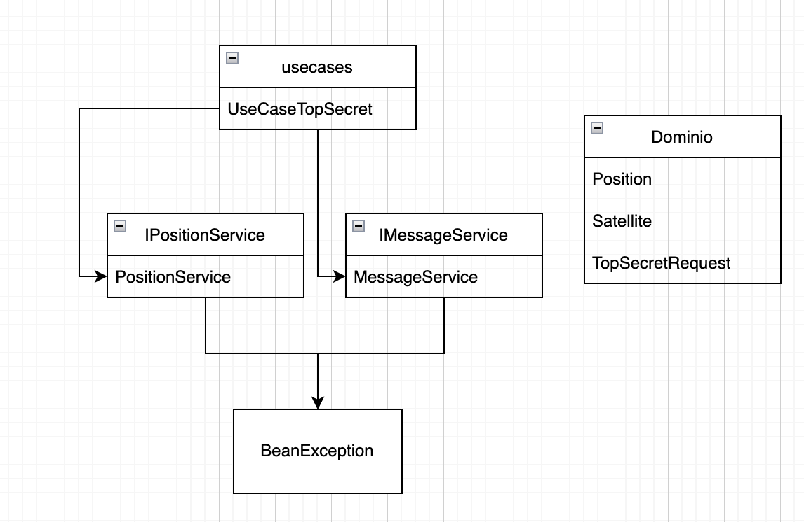
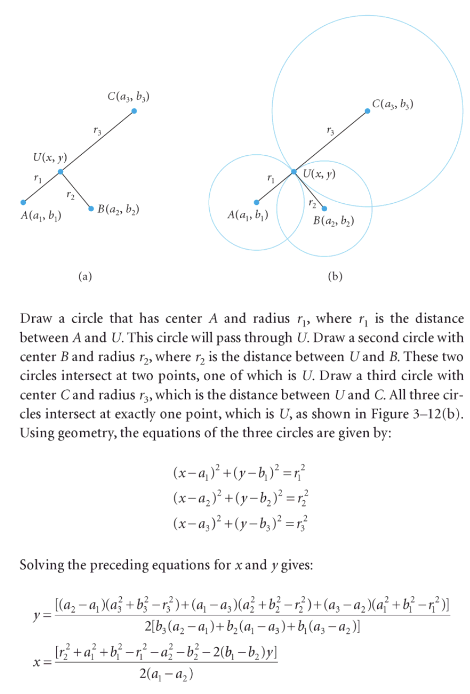

# fuego-quasar-challenge

## Java Version
La version que java que se va a utilizar es la 11.0.5 basada en el OpenJDK.

Detalle de arquitectura de clases.

`*` usecase: Componentes que publican un servicio REST.

`*` services: Interfases de clases para logica de funciones.

`*` entidades: Todas las clases que representan el negocio.

`*` exception: Clases que dan el soporte a excepciones y manejo de errores.

`*` domain: Objetos de dominio del problema y request de input de servicios.

##Componentes

En la funcuines a construir se utilizo:

**PositionService**
Para el calculo de la posicion se utilizo la siguiente formula, para obetner el punto de la posicion central.

# Creacion de instalacion

Se ejecuta mvn install para la creacion de jar el cual sera instalado en AWS.

https://www.getpostman.com/collections/b0bec1a5d421d59113c2